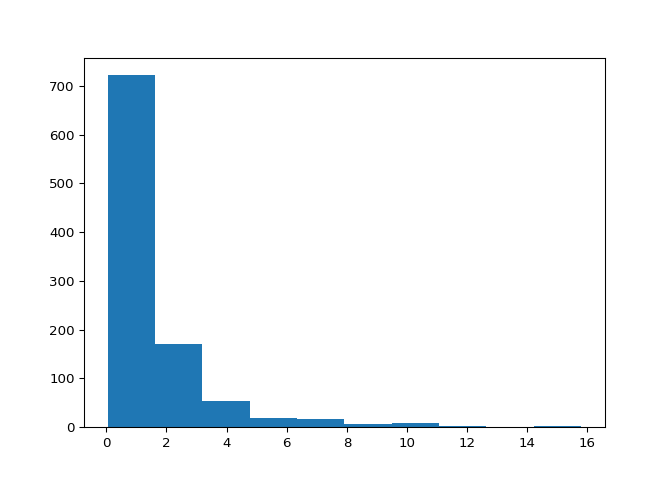

Python Notebook
================

    Dont forget to use 'source .venv/Scripts/activate' command first
    then 'pip install -r requirements.txt' to install are required packages

``` r
Sys.getenv("RETICULATE_PYTHON")
```

    ## [1] ".venv/bin/python"

``` r
library(reticulate)
use_python(".venv/bin/python")
```

``` python
import numpy as np
import pandas as pd
import matplotlib.pyplot as plt
```

``` python
def dist_lognormal():
  np.random.seed(0)
  return np.random.lognormal(size=1000)

plt.hist(dist_lognormal())
```

    ## (array([722., 170.,  53.,  19.,  17.,   6.,   8.,   2.,   1.,   2.]), array([ 0.04754194,  1.62175346,  3.19596498,  4.7701765 ,  6.34438802,
    ##         7.91859954,  9.49281106, 11.06702258, 12.6412341 , 14.21544562,
    ##        15.78965714]), <BarContainer object of 10 artists>)

``` python
plt.show()
```



``` r
# readr::write_csv(nycflights13::flights,path = "flights.csv")
```

    ## Warning: The `path` argument of `write_csv()` is deprecated as of readr 1.4.0.
    ## Please use the `file` argument instead.

``` python
heights = pd.read_csv("data/heights.csv")
# heights.head
```

``` r
head(py$heights)
```

    ##    earn   height    sex ed age  race
    ## 1 50000 74.42444   male 16  45 white
    ## 2 60000 65.53754 female 16  58 white
    ## 3 30000 63.62920 female 16  29 white
    ## 4 50000 63.10856 female 16  91 other
    ## 5 51000 63.40248 female 17  39 white
    ## 6  9000 64.39951 female 15  26 white

``` r
library(ggplot2)

ggplot(py$heights, aes(age, earn)) +
  geom_violin(aes(color=sex))
```

<!-- -->

    Run in terminal the following to transform a Rmd extension to ipynb by using jupytext
    --> jupytext --to notebook some_notebook.Rmd
